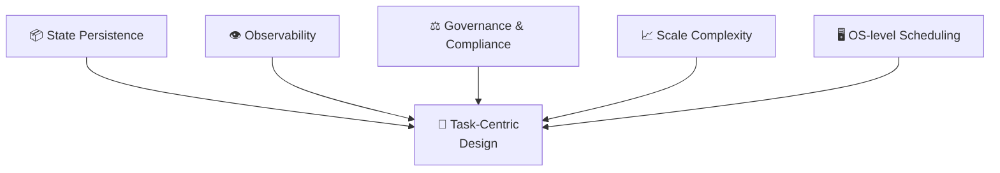

# Engineering Necessity — Why Task-Native Is the Inevitable Evolution of AI Architecture

*TOK Supplementary Document | March 2026*

---

## Abstract

As AI systems evolve from "language interface tools" to "automation infrastructure," system complexity, governance requirements, and observability needs will force architecture to shift from Prompt-centric to Task-centric. Task will become a first-class primitive in AI systems, analogous to Process in traditional operating systems.

This document argues from engineering pressure, using a five-force convergence model to demonstrate the structural inevitability of this evolution.

> This document is a supplementary argument to the [TOK Main Whitepaper](index.md), focusing on "Why" (engineering necessity), while the main whitepaper defines "What" (ontological structure) and "How" (cognitive architecture).

---

## 1. The Structural Limits of Prompt-Centric Architecture

The dominant AI system pattern today:

```
Prompt → LLM → Output
```

This pattern has three fundamental limitations:

### 1.1 State Is Bolted On

* Memory is assembled through context window concatenation
* Task progress lives in unstructured text
* No formal lifecycle definition exists

> System state doesn't belong to the system — it belongs to natural language. Natural language is not a stable state container.

**Engineering Impact**: Reliable state persistence, state recovery, and checkpoint/resume are impossible to implement.

### 1.2 No Stable Boundaries

Prompts lack:

* Task ID (identity)
* State machine
* Clear start/end definitions
* Failure semantics

**Engineering Impact**: Without boundaries, governance is impossible — SLAs, auditing, and access control cannot be built on top of unbounded text.

### 1.3 Non-Linear Complexity Growth

When systems enter multi-step reasoning, multi-tool collaboration, and multi-agent coordination scenarios:

```
O(n²) prompt glue logic
```

Every additional step or participant requires extra context management, result passing, and error handling logic. The complexity of prompt stitching grows non-linearly, making engineering unsustainable.

---

## 2. Agent Architecture: Necessary but Insufficient Intermediate Form

Agent architecture introduces tool loops and memory management:

```
LLM + Tool Loop + Memory + Planning
```

It solves some problems (dynamic tool selection, conversational memory), but still lacks:

| Missing Dimension | Description |
| :--- | :--- |
| Task-level abstraction | Agent has no task definition independent of execution flow |
| Task-level observability | Cannot measure task success rates, execution time, failure patterns |
| Task-level governance | Cannot implement task permissions, auditing, version management |
| Task-level resource management | Cannot implement task priority, resource quotas, cancellation/retry |

> Agent is a behavioral executor, but not a governable unit of work.

**OS Analogy**: Agent is to Task as Thread is to Process. Thread can execute computation, but Process is the OS's basic unit for scheduling, resource management, and lifecycle governance.

---

## 3. Scale Pressure: Enterprise AI Governance Requirements

When AI enters enterprise applications, organizations need:

| Requirement | Level | Prompt can do? | Task can do? |
| :--- | :--- | :---: | :---: |
| Success rate metrics | Governance | ❌ | ✅ |
| SLA commitments | Service | ❌ | ✅ |
| Failure tracebacks | Debugging | ⚠️ Difficult | ✅ |
| Version control | Management | ❌ | ✅ |
| Dependency graphs | Orchestration | ❌ | ✅ |
| Permissions & auditing | Compliance | ❌ | ✅ |

These are all **task-level concerns**, not prompt-level concerns. They require the system to have an identifiable, trackable, manageable unit of work — Task.

---

## 4. The Historical Abstraction Ladder

Software architecture history reveals a clear pattern: **core abstractions keep moving upward to manage growing complexity.**

| Era | Core Abstraction | Complexity Managed |
| :--- | :--- | :--- |
| Assembly | Instruction | Hardware operations |
| High-level Languages | Function | Program flow |
| OOP | Object | State and behavior |
| Distributed Systems | Service | Cross-machine communication |
| DevOps | Workflow | Deployment and delivery |
| **AI Era** | **Task** | **Intent alignment & execution governance** |

The core complexity facing AI systems is not computation (GPUs solve that), not communication (Cloud solves that), but **intent alignment** — ensuring what AI does is actually what humans want. Task is the correct abstraction level for managing this complexity.

* Task is more stable than Agent — has clear identity, state, and lifecycle
* Task is more governable than Prompt — has boundaries, success definitions, and failure handling
* Task is more semantic than Workflow — describes intent, not steps

---

## 5. The OS Analogy: Task = AI's Process

Traditional OSes don't directly manage "function calls." They manage **Process, Thread, and Job**. The reason:

> Systems need schedulable units of work.

If AI systems become infrastructure, they must have OS-level management capabilities:

| Capability | OS → Process | AI System → Task |
| :--- | :--- | :--- |
| Scheduling | ✅ Process scheduling | ✅ Task scheduling |
| Priority | ✅ Nice / Priority | ✅ Task priority |
| Cancellation | ✅ Kill / Terminate | ✅ Task cancellation |
| Retry | ✅ Auto-restart | ✅ Task retry |
| Dependencies | ✅ Process dependencies | ✅ Task dependencies |
| Resource limits | ✅ cgroup / ulimit | ✅ Task resource quota |

The structural requirements are identical. The difference: OS manages computational resources; AI systems manage **cognitive resources**.

---

## 6. The Five-Force Convergence Model

Five forces drive architecture from Prompt-centric to Task-centric:



| Force | Core Need | Prompt satisfy? | Task satisfy? |
| :--- | :--- | :---: | :---: |
| State persistence | Durable progress, history, context | ❌ | ✅ |
| Observability | Monitoring, metrics, alerting | ❌ | ✅ |
| Governance & compliance | Permissions, auditing, versioning | ❌ | ✅ |
| Scale complexity | Multi-step, multi-tool, multi-agent management | ❌ | ✅ |
| OS-level scheduling | Scheduling, cancellation, retry, priority | ❌ | ✅ |

When all five pressures exist simultaneously in a system, architecture converges to Task-centric design.

> This is not an ideological choice. It is engineering convergence.

---

## 7. Formal Definition of Task-Native Systems

A Task-native system must simultaneously satisfy these five conditions:

| Condition | Definition |
| :--- | :--- |
| **Task is a first-class object** | Task is not a parameter of an executor, but the system's core primitive |
| **Task has an explicit lifecycle** | created → claimed → executing → completed / failed |
| **Task can be scheduled and managed** | Supports scheduling, cancellation, retry, dependency management |
| **Task can be observed and measured** | Provides success rate, execution time, failure analysis metrics |
| **Agent and tools are Task executors** | Agent serves Task, not the other way around |

> Agent serves Task, not the other way around.

In the TOK system, these five conditions are realized through the [Task Object Four-Layer Structure](index.md#32-task-object-four-layer-structure) (Intent / Context / Strategy / Evaluation) and [TOCA Cognitive Architecture](index.md#4-toca-task-oriented-cognitive-architecture)'s closed-loop cycle.

---

## 8. Boundary Statement: What Is NOT Inevitable

Task-native is a structural trend, but the following are not inevitable:

* ❌ Not necessarily accomplished by any specific framework or product
* ❌ Not necessarily using the term "Task"
* ❌ Not necessarily appearing in public or open-source form

It may appear in multiple forms:

* Embedded within major AI platforms (e.g., OpenAI, Google, Anthropic backend infrastructure)
* Under names like "Workflow 2.0" or "Orchestration Engine"
* As an entirely new system abstraction

But the core idea will persist:

> Systems need an identifiable, trackable, governable unit of work. Regardless of what it's called.

---

## 9. The Central Thesis

Today's AI systems are:

> **Language-driven systems.**

Tomorrow's AI systems will be:

> **Task-governed systems.**

| Dimension | Language-driven | Task-governed |
| :--- | :--- | :--- |
| Core driver | Natural language Prompt | Structured Task Object |
| State management | Context concatenation | Task lifecycle |
| Governance basis | None | Task ID + State Machine |
| Observability | Logs | Task Metrics |
| Evolution mechanism | Manual Prompt tuning | Automatic strategy evolution (TOCA Evolve) |

Language is the interface. Task is the structure.

Interfaces can change endlessly — natural language, GUI, API, voice.
Structure must be stable — identity, state, lifecycle, dependencies.

---

## 10. Conclusion

As AI evolves from "language interface tool" to "automation infrastructure," Task will evolve from "concept" to "system primitive."

This evolution is not a philosophical choice. It is an engineering inevitability.

Five forces — **state persistence, observability, governance & compliance, scale complexity, and OS-level scheduling** — simultaneously bear down on every AI system attempting to scale. Their intersection has one and only one answer: **Task-centric design**.

What TOK provides is the formalized ontological definition for this inevitably arriving Task-centric world.

---

## Further Reading

* [TOK Main Whitepaper](index.md) — Complete Task Ontology Kernel definition
* [TOK FAQ](faq.md) — Frequently Asked Questions
* [TOK Glossary](glossary.md) — Core concept reference

---

*TOK Version 1.0 | March 2026*  
*For updates and contributions, visit [GitHub Repository](https://github.com/enjtorian/task-ontology-kernel)*

---

**License:** This work is licensed under [CC BY 4.0](https://creativecommons.org/licenses/by/4.0/). You are free to share and adapt with attribution.
