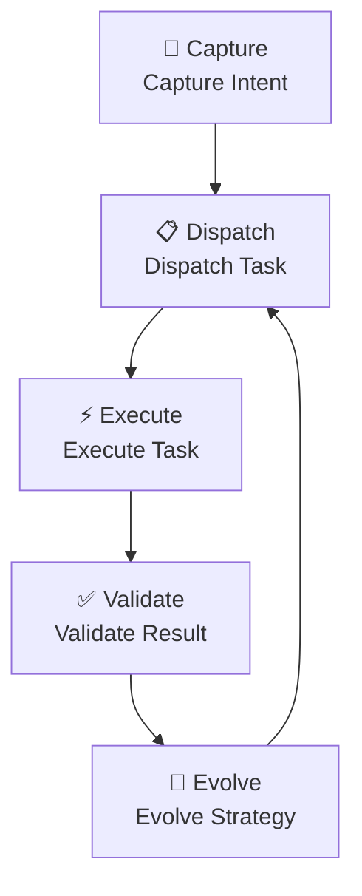
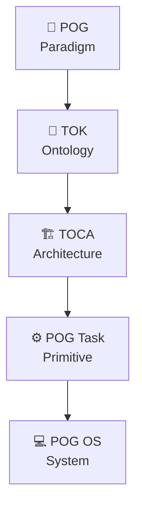
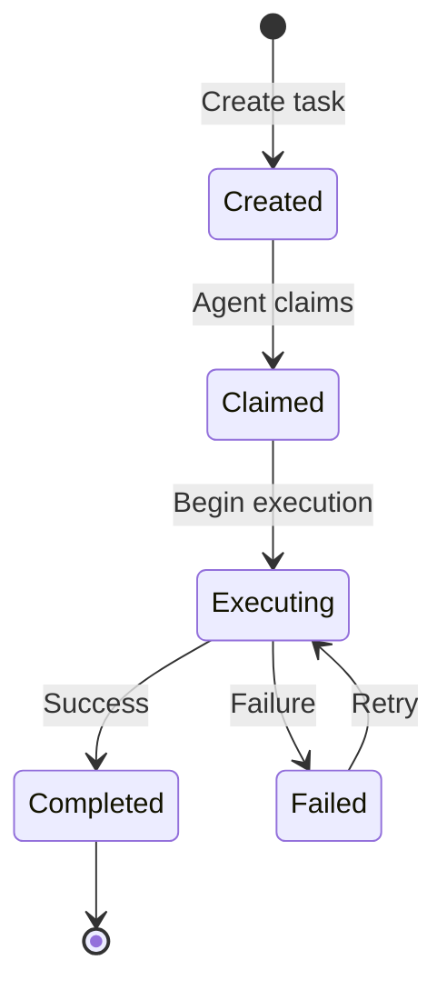

# Task Ontology Kernel (TOK) — AI-Native Task Ontology Core

*TOK Version 1.0 | March 2026*

---

## 1. Executive Summary

Since the 1950s, the evolution of software engineering has been driven by rising **abstraction layers**. We moved from machine instructions (Machine-native), to functions and classes (Code-native), to APIs and microservices (Service-native).

Today, as Large Language Models (LLMs) become **Universal Cognitive Executors**, we reach the fourth inflection point: **Task-native**.

**Task Ontology Kernel (TOK)** is the theoretical core for this paradigm shift. It defines the ontological structure of tasks—identity, state, lifecycle, dependencies, and evolution—transforming tasks from unstructured mental concepts into **system-level primitives that can be natively executed, versioned, governed, and evolved by AI**.

> In Task-native systems, tasks become the smallest native unit of execution, governance, and evolution, while code becomes a derivative artifact generated or orchestrated by tasks.

**Key highlights:**
*   **Formalized Task Ontology**: Defines the Intent, Context, Strategy, and Evaluation layers of a Task Object.
*   **TOCA Cognitive Architecture**: A closed-loop cognitive system centered on tasks—Capture, Dispatch, Execute, Validate, Evolve.
*   **Git-native Versioning**: Task definitions and execution traces are fully versioned for traceability and auditability.
*   **AI-native Execution**: Tasks are executed by Agents, not scripts; Agents autonomously select tools and strategies.

📖 **Further Reading**: [POG Task — AI-Native Task Governance Model](https://enjtorian.github.io/pog-task/) | [Prompt Orchestration Governance Whitepaper](https://enjtorian.github.io/prompt-orchestration-governance-whitepaper/)

---

## 2. From Prompt to Task: Discovering a New Abstraction Layer

### The Starting Point

When using LLMs repeatedly, we notice something fundamental: **Prompts are not just disposable instructions—they are reusable cognitive structures.**

If a prompt is used more than once, it stops being a prompt. It becomes a **task**.

```
Stage 1: Prompt            → "Write a login API for me"
Stage 2: Reusable Prompt   → Prompt template libraries
Stage 3: POG               → Prompt orchestration & governance
Stage 4: POG Task          → Prompt → executable task object
Stage 5: TOK               → Task → formalized ontology object
```

This evolution mirrors the birth of Kubernetes:

```
Shell scripts → Script reuse → Docker containers → Container orchestration → Kubernetes ontology kernel (Pod, Service, Deployment)
```

The essence of a prompt is **Unstructured Execution Intent**, which inevitably evolves toward structured tasks, then toward a formalized ontological model.

### Why Now?

Because **LLMs are the first "Universal Task Executors" in human history**.

Before LLMs, only two types of executors existed: humans, or specialized software. Tasks could only exist in human minds or unstructured records. LLMs changed everything: for the first time, tasks can be directly interpreted and executed by machines.

This means tasks must transform from "mental concepts" into **executable system structures**:

*   Machine-readable
*   Persistent
*   Structured
*   Versionable
*   Composable

> Tasks have always existed, but this is the first time in human history that tasks themselves can become executable system units, rather than just mental units.

---

## 3. Task Ontology Kernel (TOK): The Ontological Definition of Tasks

### 3.1 What is TOK?

**Task Ontology Kernel** defines the existential nature of tasks—it answers three fundamental questions:

1.  **What is a task?** — Structure, identity, and properties
2.  **How does a task exist?** — State, lifecycle, and dependencies
3.  **How does a task evolve?** — Versioning, feedback, and strategy iteration

TOK is not an implementation, not a system, but a **Theoretical Foundation**.

Analogous theoretical foundations:

| Theoretical Foundation | Derived Systems |
| :--- | :--- |
| Lambda Calculus | Programming Languages |
| Relational Model | Relational Databases |
| **Task Ontology Kernel** | **Task-native Systems** |

### 3.2 Task Object: Four-Layer Structure

In TOK, a standard **Task Object** comprises four core dimensions:

#### Intent Layer
*   Describes the "Goal State," not "execution steps."
*   Semantically clear, interpretable by LLMs as decision logic.

#### Context Layer
*   Environmental boundaries and resource access required for task execution.
*   Includes domain knowledge, historical execution records, and real-time data slots via MCP (Model Context Protocol).

#### Strategy Layer
*   Task decomposition logic and tool selection preferences.
*   Strategy is not hardcoded—it evolves with experience as a "path guide."

#### Evaluation Layer
*   Task success verification protocol (Definition of Done).
*   Includes automated tests, Semantic Alignment checks, and human feedback loops.

### 3.3 Task Object Example

```json
{
  "id": "task-001",
  "intent": "Summarize API performance logs and generate a report",
  "context": {
    "domain": "backend",
    "history": ["task-000"],
    "resources": ["DB read access", "log storage"]
  },
  "strategy": {
    "steps": ["aggregate logs", "calculate percentile metrics", "generate summary"],
    "tools": ["Python script", "LLM"]
  },
  "evaluation": {
    "definitionOfDone": "Summary matches log metrics and passes human feedback",
    "tests": ["unit test", "semantic alignment check"]
  }
}
```

### 3.4 TOK Core Schema

```yaml
version: 1.0
kernel:
  description: |
    Task Ontology Kernel provides a universal task kernel, transforming tasks
    from abstract definitions into executable objects, supporting AI Agent
    auto-execution, version control, task dependencies, and lifecycle management.

tasks:
  - id: string
  - name: string
  - description: string
  - type: string
  - inputs:
      - name: string
        type: string        # file, string, number, object
        required: bool
  - outputs:
      - name: string
        type: string
  - status: string          # pending | in_progress | completed | failed
  - metadata:
      created_at: datetime
      updated_at: datetime
      version: string
      tags: [string]
  - relations:
      depends_on: [string]
      produces: [string]

execution:
  agent:
    type: llm | toolchain | hybrid
    capabilities: [read, write, mutate]
  runtime:
    max_attempts: integer
    retry_strategy: linear | exponential | manual
  audit:
    enabled: true
    log_location: string

lifecycle:
  states: [created, claimed, executing, completed, failed]
  transitions:
    - from: created → to: claimed
    - from: claimed → to: executing
    - from: executing → to: completed
    - from: executing → to: failed

versioning:
  repository: git
  branch: string
  commit_hash: string
  history: [string]
```

---

## 4. TOCA: Task-Oriented Cognitive Architecture

### 4.1 Why TOCA?

TOK defines "what a task is." **TOCA (Task-Oriented Cognitive Architecture)** defines "how tasks operate within cognitive systems."

Traditional computing follows an Input → Process → Output (IPO) model. In AI-native environments, we need a **goal-oriented closed-loop system**—tasks are not executed once; they continuously evolve.

> TOCA is a cognitive architecture where tasks serve as the primary persistent unit of cognition, enabling humans and AI to collaboratively execute, evolve, and reuse structured cognitive processes.

### 4.2 TOCA Core Loop



*   **Capture**: Human → Task — Structure fuzzy intent into a Task Object.
*   **Dispatch**: Task → Executor — Route to the best execution unit (LLM, code module, or human).
*   **Execute**: Executor → Result — Produce results within Context boundaries, recording full execution traces.
*   **Validate**: Result → Evaluation — Judge whether Intent is achieved via the evaluation protocol.
*   **Evolve**: Result → Task Evolves — Feed execution experience back to Ontology, automatically optimizing the next Strategy.

### 4.3 TOCA vs Traditional Models

| Model | State Form | Core Unit | Evolution |
| :--- | :--- | :--- | :--- |
| Chat-based | Ephemeral | Prompt → Response | ❌ None |
| Tool-based | External but rigid | Tool calls | ❌ None |
| **TOCA** | **Persistent & evolvable** | **Task Object** | **✅ Auto-evolving** |

---

## 5. Five-Layer Architecture: From Paradigm to System

TOK, TOCA, and the POG family form a complete conceptual stack:

| Layer | Name | Defines | Role |
| :--- | :--- | :--- | :--- |
| **Paradigm** | POG | Why tasks replace prompts | Conceptual shift |
| **Ontology** | TOK | What a task is | Existence definition |
| **Architecture** | TOCA | How tasks operate in cognition | Cognitive model |
| **Primitive** | POG Task | Minimal executable task unit | Execution unit |
| **System** | POG OS | Runtime and governance system | Implementation |



**Key insight**: The core invention is not POG OS, but **TOK**. Just as the Relational Model shaped the database world, TOK shapes the Task-native world.

---

## 6. Software Engineering Paradigm Evolution

### 6.1 Four Eras of Production Primitives

| Era | Period | Primitive | Core Challenge | Asset Form |
| :--- | :--- | :--- | :--- | :--- |
| Machine-native | 1950s | Machine instructions | Hardware compatibility | Paper tape / Punch cards |
| Code-native | 1970s–now | Function / Class | Syntactic correctness | Codebase (Git) |
| Service-native | 2005–now | API / Microservice | Interface stability | Cloud Infrastructure |
| **Task-native** | **2023–future** | **Task / Intent** | **Intent alignment & governance** | **Task Graph (TOCA)** |

### 6.2 From Code-native to Task-native

Code-native era:

```
Human intent → Translate to code → Computer executes code
```

Task-native era:

```
Human intent → Structure as task → Agent executes task
                ↓
            Code (optional derivative)
```

**Code shifts from "core asset" to "derivative tool."** Not because code is unimportant, but because LLMs changed the fundamental unit of software production.

Three irreversible conditions drive this evolution:

1.  **LLMs are universal cognitive executors**: They can execute analysis, writing, planning, transformation—without specific code.
2.  **Humans naturally think in tasks**: People think "analyze logs" or "design system," not "write a for-loop" or "create a class."
3.  **Code generation is automated**: When LLMs can generate code, "how to implement" is no longer scarce—"what to do" is.

---

## 7. TOK vs Existing Systems

### 7.1 Four-Dimension Coverage

TOK covers **Ontology + Execution + AI-native + Versioned**—the only architecture with complete coverage:

| Type | Representative | Ontology | Task Exec | Git | AI Exec | Complete? |
| :--- | :--- | :---: | :---: | :---: | :---: | :---: |
| Workflow engines | Temporal, Airflow | ❌ | ✅ | ❌ | ❌ | ❌ |
| Data ontology | Palantir Foundry | ✅ | ⚠️ | ❌ | ⚠️ | ❌ |
| Infra as Code | Terraform | ❌ | ✅ | ✅ | ❌ | ❌ |
| AI agent frameworks | LangChain, AutoGen | ❌ | ✅ | ⚠️ | ✅ | ❌ |
| **TOK** | **Task Ontology Kernel** | **✅** | **✅** | **✅** | **✅** | **✅** |

### 7.2 Key Difference from Palantir Ontology

TOK and Palantir Foundry Ontology use the same architectural pattern, but with **different primitives**:

| Concept | Palantir | TOK |
| :--- | :--- | :--- |
| Primitive | Object | Task |
| Models | Reality (what exists) | Intent (how things change) |
| Execution | Passive: human-triggered | Active: agent-autonomous |
| Evolution | Data evolves | Execution evolves |
| Essence | Ontology over data | Ontology over execution |

### 7.3 System Primitive Comparison

| System | Primitive | Essence |
| :--- | :--- | :--- |
| Unix / Linux | Process | Process Ontology Kernel |
| Git | Commit | Version Ontology Kernel |
| Kubernetes | Pod | Container Ontology Kernel |
| Palantir Foundry | Object | Entity Ontology Kernel |
| **TOK** | **Task** | **Task Ontology Kernel** |

---

## 8. TOK in the POG Ecosystem

### 8.1 Evolution from POG to TOK

```
Stage 1: Prompt      → One-time natural language instruction
Stage 2: POG         → Prompt orchestration & governance framework
Stage 3: POG Task    → Prompt → executable task object (YAML)
Stage 4: TOK         → Task → formalized ontology core
```

*   **POG** = Why prompts should become governed tasks (Why)
*   **POG Task** = Minimal executable task unit (What)
*   **TOK** = Formalized execution substrate for tasks (How it exists)

### 8.2 Agent-Native Execution

In TOK, tasks are not scripts—they are **delegated to Agents who decide how to execute**:

```
Task
  ↓
Execution Engine (selects Agent)
  ↓
Agent autonomously decides execution approach
  ↓
Agent may use:
   - Scripts / Shell
   - API calls
   - Filesystem operations
   - LLM reasoning
   - Create new tasks
```

This upgrade transforms the system from "Automation System" to "Autonomous Execution System."

---

## 9. Task Lifecycle



1.  **Created**: Generate Task ID, define Intent, Context, Strategy, Evaluation.
2.  **Claimed**: Agent accepts execution contract, updates `claimed_by`.
3.  **Executing**: Agent executes within Context boundaries, recording full traces.
4.  **Completed / Failed**: Validate whether Intent is achieved, record artifacts.
5.  **Evolve**: Feed execution experience back into Strategy for next iteration.

All state transitions are versioned via Git commit for full traceability and auditability.

---

## 10. Evaluation & Benefits

### For Software Engineers
*   Shift from "code craftsman" to "task design architect."
*   Focus on "what to do" (Intent), not "how to implement."

### For AI Agents
*   Deterministic, machine-readable task definitions.
*   Autonomously claim, execute, record, and evolve tasks.

### For Organizations
*   **Full audit trail**: Every task's execution reasoning and decisions are traceable.
*   **Cross-domain universal**: The same TOK applies to software development, manufacturing, healthcare, logistics.
*   **Git-native**: Naturally integrates with existing version control workflows.

---

## 11. Roadmap & Future Work

| Phase | Feature |
| :--- | :--- |
| **v1** | TOK Core Schema, TOCA core loop, POG Task integration |
| **v2** | Cross-domain task templates, multi-agent orchestration, Task Graph visualization |
| **v3** | AI auto task decomposition, strategy evolution engine, governance dashboard |
| **v4** | Complete Task-native SDLC ecosystem, community task marketplace |

**Future Vision:**

Software will no longer be static codebases, but dynamically evolving task graphs. Engineers design tasks and governance rules; AI handles execution and evolution.

> "Software is no longer built; it is orchestrated. Tasks are the new code."

---

## 12. Appendices

### Quick Reference

| Name | Full Name | Definition |
| :--- | :--- | :--- |
| **TOK** | Task Ontology Kernel | Defines the ontological structure of tasks—identity, state, dependencies, evolution |
| **TOCA** | Task-Oriented Cognitive Architecture | Closed-loop cognitive architecture centered on tasks |
| **POG** | Prompt Orchestration Governance | Paradigm transforming prompts into governed tasks |
| **POG Task** | — | Concrete implementation of TOK for software development |
| **POG OS** | — | Operating system for managing and running Task-native systems |

### Related Links

*   [POG Task — AI-Native Task Governance Model](../../docs/index.md)
*   [POG Whitepaper](https://enjtorian.github.io/prompt-orchestration-governance-whitepaper/)
*   [POG Task GitHub](https://github.com/enjtorian/pog-task)
*   [VS Code Plugin](https://marketplace.visualstudio.com/items?itemName=enjtorian.pog-task-manager)

---

## About the Author

**Ted Enjtorian**  
*Framework Observer & Primary Author*

As a software systems architect with over 20 years of experience, I noticed a fundamental shift while repeatedly using LLMs: prompts are no longer disposable instructions—they are reusable cognitive structures. This insight revealed a deeper truth—**tasks are evolving from mental units of humans into execution primitives of systems**.

TOK is not an invention but a formalized description of a natural evolutionary process. Just as Unix didn't invent the concept of "file" but was the first to formalize it as a system primitive, TOK is the first to formalize "task" as a system primitive natively executable by AI.

**Connect:**  
- 🔗 LinkedIn: https://tw.linkedin.com/in/enjtorian
- 💻 GitHub: [@enjtorian](https://github.com/enjtorian)

For detailed contributor information and citation guidelines, see [AUTHORS.md](https://github.com/enjtorian/task-ontology-kernel/blob/main/AUTHORS.md).

---

*TOK Version 1.0 | March 2026*  
*For updates and contributions, visit [GitHub Repository](https://github.com/enjtorian/pog-task)*

---

**License:** This work is licensed under [CC BY 4.0](https://creativecommons.org/licenses/by/4.0/). You are free to share and adapt with attribution.

---

## Content Authority Statement

The content presented in this document is intended to provide a consistent definition and conceptual framework for **Task Ontology Kernel (TOK)** and **Task-Oriented Cognitive Architecture (TOCA)** for purposes of research, implementation, and discussion. This work originates from systematic observation and formalization of recurring patterns in AI-native software development practices, representing a theoretical exploration of the paradigm evolution from Code-native to Task-native in software engineering. It is offered as a unified logical framework for evolving industry practice, not as a prescriptive standard or academic assertion.

*Last Updated: March 2026 | TOK Version 1.0*
