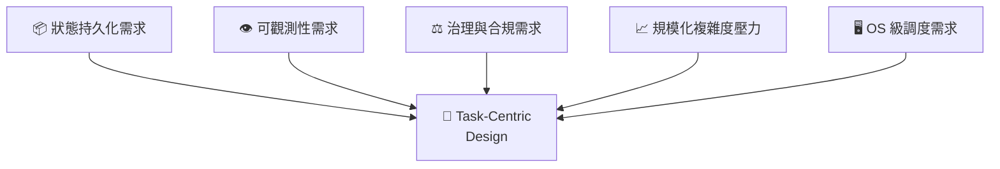

# 工程必然性論證：為什麼 Task-Native 是 AI 架構的必然演化

*TOK 補充文件 | 2026年3月*

---

## 摘要

當 AI 系統從「語言介面工具」演化為「自動化基礎設施」時，系統複雜度、治理需求與可觀測需求將迫使架構從 Prompt-centric 轉向 Task-centric。Task 將成為 AI 系統中的第一級原語（first-class primitive），類似於傳統作業系統中的 Process。

本文從工程壓力切入，透過五力收斂模型論證這一演化的結構性必然。

> 本文件為 [TOK 主白皮書](index.md) 的補充論證文件，聚焦「為什麼」（Why），而主白皮書定義「是什麼」（What）與「如何存在」（How）。

---

## 1. Prompt-Centric 架構的結構性極限

現有主流 AI 系統模式：

```
Prompt → LLM → Output
```

此模式有三個根本限制：

### 1.1 狀態是外掛式的

* 記憶透過 context window 拼接
* 任務進度存在於非結構化文本中
* 無正式生命週期（lifecycle）定義

> 系統狀態不屬於系統，而屬於自然語言。自然語言不是穩定的狀態容器。

**工程影響**：無法實現可靠的狀態持久化、狀態恢復與斷點續傳。

### 1.2 無法形成穩定邊界

Prompt 缺乏：

* 任務 ID（identity）
* 狀態機（state machine）
* 明確的開始/結束定義
* 失敗語意（failure semantics）

**工程影響**：沒有邊界就無法實現治理SLA、審計、權限控制全部無法建立在無邊界的文字之上。

### 1.3 複雜度呈非線性成長

當系統進入多步推理、多工具協作、多代理協同的場景：

```
O(n²) prompt glue logic
```

每多一個步驟或參與者，就需要額外的 context 管理、結果傳遞與錯誤處理邏輯。Prompt 拼接的複雜度呈非線性增長，工程不可持續。

---

## 2. Agent 架構：必要但不充分的中間形態

Agent 架構引入了工具循環與記憶管理：

```
LLM + Tool Loop + Memory + Planning
```

它解決了部分問題（動態工具選擇、對話記憶），但仍然缺乏：

| 缺失維度 | 說明 |
| :--- | :--- |
| 任務級抽象 | Agent 沒有獨立於執行流程的任務定義 |
| 任務級觀測 | 無法統計任務成功率、執行時間、失敗模式 |
| 任務級治理 | 無法做任務權限、審計、版本管理 |
| 任務級資源管理 | 無法做任務優先級、資源配額、取消/重試 |

> Agent 是行為執行器，但不是可治理的工作單位。

**OS 類比**：Agent 之於 Task，正如 Thread 之於 Process。Thread 可以執行計算，但 Process 才是 OS 調度、資源管理與生命週期治理的基本單位。

---

## 3. 規模化壓力：企業級 AI 的治理需求

當 AI 進入企業級應用，企業需要：

| 需求 | 層級 | Prompt 能做？ | Task 能做？ |
| :--- | :--- | :---: | :---: |
| 成功率統計 | 治理層 | ❌ | ✅ |
| SLA 承諾 | 服務層 | ❌ | ✅ |
| 失敗回溯 | 調試層 | ⚠️ 困難 | ✅ |
| 版本控制 | 管理層 | ❌ | ✅ |
| 依賴圖 | 編排層 | ❌ | ✅ |
| 權限與審計 | 合規層 | ❌ | ✅ |

這些需求全部是**任務層級問題**，不是 Prompt 層級問題。它們要求系統具備一個可識別、可追蹤、可管理的工作單位Task。

---

## 4. 工程歷史的抽象上移規律

軟體架構的歷史呈現一條清晰的規律：**核心抽象持續上移，以管理日增的複雜度。**

| 時代 | 核心抽象 | 管理的複雜度 |
| :--- | :--- | :--- |
| Assembly | 指令 (Instruction) | 硬體操作 |
| 高階語言 | 函數 (Function) | 程序流程 |
| OOP | 物件 (Object) | 狀態與行為 |
| 分散式系統 | 服務 (Service) | 跨機器通訊 |
| DevOps | Workflow | 部署與交付 |
| **AI 時代** | **Task** | **意圖對齊與執行治理** |

AI 系統面臨的核心複雜度不是計算（GPU 解決），不是通訊（Cloud 解決），而是**意圖對齊**確保 AI 做的事真的是人類要的。Task 正是管理這種複雜度的正確抽象層級。

* Task 比 Agent 穩定擁有明確的身份、狀態與生命週期
* Task 比 Prompt 可治理擁有邊界、成功定義與失敗處理
* Task 比 Workflow 更語意化描述意圖而非步驟

---

## 5. OS 類比：Task = AI 世界的 Process

傳統 OS 不直接管理「函數呼叫」。它管理的是 **Process、Thread、Job**。原因是：

> 系統需要可調度的工作單位。

如果 AI 系統成為基礎設施，它必須具備 OS 級的管理能力：

| 管理能力 | OS 對 Process | AI 系統對 Task |
| :--- | :--- | :--- |
| 排程 | ✅ Process scheduling | ✅ Task scheduling |
| 優先級 | ✅ Nice / Priority | ✅ Task priority |
| 取消 | ✅ Kill / Terminate | ✅ Task cancellation |
| 重試 | ✅ Auto-restart | ✅ Task retry |
| 依賴 | ✅ Process dependencies | ✅ Task dependencies |
| 資源限制 | ✅ cgroup / ulimit | ✅ Task resource quota |

兩者的結構需求完全一致。差異在於：OS 管理的是計算資源，AI 系統管理的是**認知資源**。

---

## 6. 五力收斂模型

推動架構從 Prompt-centric 走向 Task-centric 的五股壓力：



| 壓力方向 | 核心需求 | Prompt 能否滿足 | Task 能否滿足 |
| :--- | :--- | :---: | :---: |
| 狀態持久化 | 進度、歷史、上下文持久保存 | ❌ | ✅ |
| 可觀測性 | 監控、統計、告警 | ❌ | ✅ |
| 治理與合規 | 權限、審計、版本 | ❌ | ✅ |
| 規模化壓力 | 多步、多工具、多代理管理 | ❌ | ✅ |
| OS 級調度 | 排程、取消、重試、優先級 | ❌ | ✅ |

當五種壓力同時存在於一個系統中，架構將收斂至 Task-centric design。

> 這不是理念選擇，而是工程收斂。

---

## 7. Task-Native 系統的形式化定義

一個 Task-native 系統必須同時滿足以下五個條件：

| 條件 | 定義 |
| :--- | :--- |
| **Task 為第一級物件** | Task 不是某個執行器的參數，而是系統的核心原語 |
| **Task 擁有明確 lifecycle** | created → claimed → executing → completed / failed |
| **Task 可被調度與管理** | 支持排程、取消、重試、依賴管理 |
| **Task 可被觀測與統計** | 提供成功率、執行時間、失敗分析等指標 |
| **Agent 與工具是 Task 的執行器** | Agent 服務於 Task，而不是 Task 附屬於 Agent |

> Agent 服務於 Task，而不是相反。

在 TOK 體系中，這五個條件透過 [Task Object 四層結構](index.md#32-task-object-四層結構)（Intent / Context / Strategy / Evaluation）和 [TOCA 認知架構](index.md#4-toca任務導向認知架構) 的閉環循環來實現。

---

## 8. 邊界聲明：非必然之處

Task-native 是結構性趨勢，但以下並非必然：

* ❌ 不一定由某個特定框架或產品完成
* ❌ 不一定使用 "Task" 這個名詞
* ❌ 不一定以公開開源的形式出現

它可能以多種形態出現：

* 內嵌於大型 AI 平台（如 OpenAI、Google、Anthropic 的後端基礎設施）
* 以 Workflow 2.0、Orchestration Engine 的名義出現
* 以某個全新的系統抽象形式出現

但核心思想不會消失：

> 系統需要一個可被識別、可被追蹤、可被治理的工作單位。不管它叫什麼名字。

---

## 9. 關鍵命題

現在的 AI 系統是：

> **Language-driven systems.（語言驅動系統）**

未來的 AI 系統將是：

> **Task-governed systems.（任務治理系統）**

| 維度 | Language-driven | Task-governed |
| :--- | :--- | :--- |
| 核心驅動 | 自然語言 Prompt | 結構化 Task Object |
| 狀態管理 | Context 拼接 | Task lifecycle |
| 治理基礎 | 無 | Task ID + State Machine |
| 可觀測性 | Log | Task Metrics |
| 演化方式 | 手動調整 Prompt | 策略自動演化（TOCA Evolve） |

語言是介面，任務是結構。

介面可以千變萬化自然語言、GUI、API、語音。
結構必須穩定身份、狀態、生命週期、依賴。

---

## 10. 結論

當 AI 從「語言介面工具」演化為「自動化基礎設施」時，Task 將從「概念」變成「系統原語」。

這種演化不是哲學選擇，而是工程必然。

五股壓力**狀態持久化、可觀測性、治理合規、規模化複雜度、OS 級調度**同時施加在每一個嘗試規模化的 AI 系統上。它們的交叉點只有一個：**Task-centric design**。

TOK 所做的，就是為這個必然到來的 Task-centric 世界，提供形式化的本體定義。

---

## 延伸閱讀

* [TOK 主白皮書](index.md) — Task Ontology Kernel 完整定義
* [TOK FAQ](faq.md) — 常見問題
* [TOK 術語表](glossary.md) — 核心概念速查

---

*TOK 版本 1.0 | 2026年3月*  
*如需更新與貢獻，請訪問 [GitHub 儲存庫](https://github.com/enjtorian/task-ontology-kernel)*

---

**授權：** 本作品採用 [CC BY 4.0](https://creativecommons.org/licenses/by/4.0/) 授權。您可以自由分享與修改，但需註明出處。
