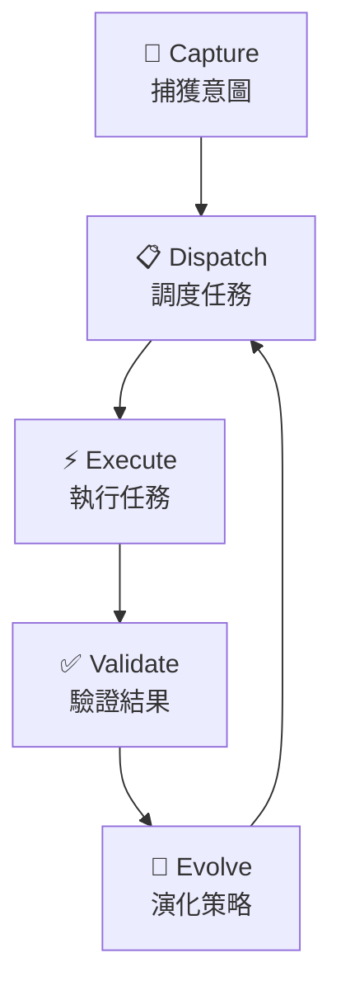
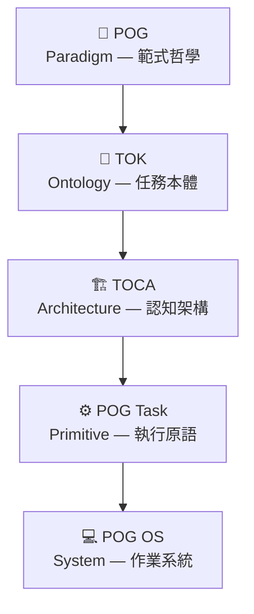
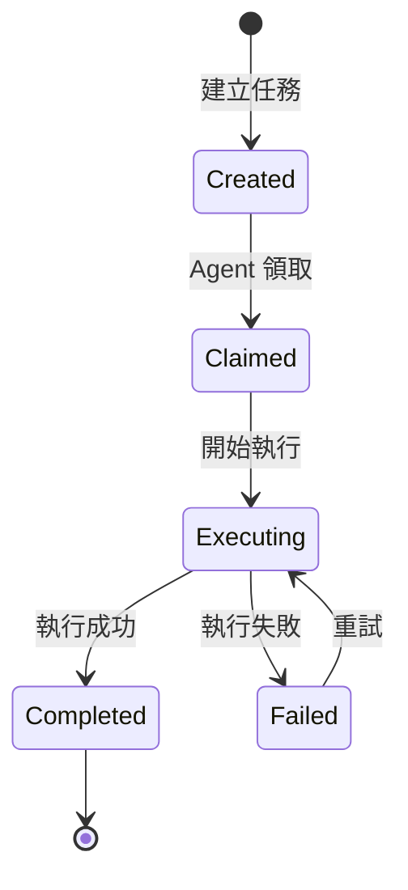

# Task Ontology Kernel (TOK) — AI 原生任務本體核心

*TOK 版本 1.0 | 2026年3月*

---

## 1. 執行摘要

自 1950 年代以來，軟體工程的演進始終圍繞著「抽象層」的提升。我們從操作機器指令（Machine-native），演進到編寫函數與類別（Code-native），再到調用 API 與微服務（Service-native）。

今天，隨著大型語言模型（LLM）成為**通用認知執行器（Universal Cognitive Executor）**，我們抵達了第四個臨界點：**Task-native（任務原生）**。

**Task Ontology Kernel（TOK）** 正是為這一範式轉移而生的理論核心。它定義了任務的本體結構身份、狀態、生命週期、依賴關係與演化方式使任務從非結構化的心理概念，轉化為**可被 AI 原生執行、版本化、治理與演化的系統級 Primitive**。

> 在 Task-native 系統中，任務成為執行、治理與演化的最小原生單位，而程式碼則成為由任務生成或協調的衍生產物。

**核心亮點：**
*   **任務本體形式化**：定義 Task Object 的 Intent、Context、Strategy、Evaluation 四層結構。
*   **TOCA 認知架構**：提供以任務為核心的閉環認知系統捕獲、調度、執行、驗證、演化。
*   **Git-native 版本化**：任務定義與執行歷程完整版本化，確保可追溯與可審計。
*   **AI-native 執行**：任務由 Agent 執行，而非直接執行腳本；Agent 自主選擇工具與策略。

📖 **延伸閱讀**: [POG Task — AI 原生任務治理模型](https://enjtorian.github.io/pog-task/zh-tw/) | [Prompt Orchestration Governance Whitepaper](https://enjtorian.github.io/prompt-orchestration-governance-whitepaper/zh-tw/)

---

## 2. 從 Prompt 到 Task：一個抽象層的發現

### 問題的起點

當我們反覆使用 LLM 時，會注意到一個現象：**Prompt 不只是一次性的指令，它們是可重用的認知結構。**

如果一個 Prompt 被使用超過一次，它就不再只是 Prompt它成為了一個**任務（Task）**。

```
Stage 1: Prompt            → 「幫我寫登入 API」
Stage 2: Reusable Prompt   → Prompt 模板庫
Stage 3: POG               → Prompt 編排與治理
Stage 4: POG Task          → Prompt → 可執行任務物件
Stage 5: TOK               → 任務 → 形式化本體物件
```

這一演進與 Kubernetes 的誕生路徑完全一致：

```
Shell scripts → Script 重用 → Docker 容器 → 容器編排 → Kubernetes 本體核心（Pod, Service, Deployment）
```

Prompt 的本質是**未結構化的執行意圖（Unstructured Execution Intent）**，它必然走向結構化（Task），再走向形式化模型（Ontology）。

### 為什麼現在才發生？

因為 **LLM 是人類歷史上第一個「通用任務執行器」**。

在 LLM 出現之前，只有兩種執行器：人類，或特定軟體。任務只能存在於人腦或非結構化記錄中。LLM 改變了這一切：任務第一次可以被機器直接解讀與執行。

這導致任務必須從「人類的心理概念」轉變為**可執行的系統結構**：

*   Machine-readable（機器可讀）
*   Persistent（持久化）
*   Structured（結構化）
*   Versionable（可版本化）
*   Composable（可組合）

> 任務一直存在，但這是人類歷史上第一次，任務本身可以成為可執行的系統單位，而不只是人類的心理單位。

---

## 3. Task Ontology Kernel (TOK)：任務的本體定義

### 3.1 TOK 是什麼？

**Task Ontology Kernel（任務本體核心）** 定義了任務的存在本質它回答三個根本問題：

1.  **什麼是任務？** — 任務的結構、身份與屬性
2.  **任務如何存在？** — 任務的狀態、生命週期與依賴
3.  **任務如何演化？** — 任務的版本、反饋與策略迭代

TOK 不是實作，不是系統，而是 **理論基礎（Theoretical Foundation）**。

類比其他領域的理論核心：

| 理論基礎 | 衍生系統 |
| :--- | :--- |
| Lambda Calculus | 程式語言 |
| Relational Model | 關聯式資料庫 |
| **Task Ontology Kernel** | **Task-native 系統** |

### 3.2 Task Object 四層結構

在 TOK 中，一個標準的 **Task Object（任務物件）** 由四個核心維度構成：

#### Intent（意圖層）
*   描述「最終目標狀態」（Goal State），而非「執行步驟」。
*   具備語義清晰度，能被 LLM 解譯為判斷邏輯。

#### Context（上下文層）
*   執行任務所需的環境邊界與資源存取權限。
*   包括領域知識、歷史執行紀錄，以及 MCP（Model Context Protocol）提供的實時數據插槽。

#### Strategy（策略層）
*   任務的分解邏輯與工具選擇偏好。
*   Strategy 並非寫死的代碼，而是可隨經驗演化的「路徑指引」。

#### Evaluation（評量層）
*   任務成功的驗證協議（Definition of Done）。
*   包含自動化測試、意圖對齊校核（Semantic Alignment）與人類反饋循環。

### 3.3 Task Object 範例

```json
{
  "id": "task-001",
  "intent": "分析 API 執行效能日誌，產生摘要報告",
  "context": {
    "domain": "backend",
    "history": ["task-000"],
    "resources": ["DB read access", "log storage"]
  },
  "strategy": {
    "steps": ["彙整日誌", "計算百分位效能指標", "產生摘要"],
    "tools": ["Python script", "LLM"]
  },
  "evaluation": {
    "definitionOfDone": "摘要與日誌指標吻合，且通過人類反饋",
    "tests": ["unit test", "semantic alignment check"]
  }
}
```

此 Task Object 展示了 Intent / Context / Strategy / Evaluation 四層結構，能被 LLM 直接解析與執行。

### 3.4 TOK Core Schema

```yaml
version: 1.0
kernel:
  description: |
    Task Ontology Kernel 提供通用任務內核，將任務從抽象定義轉化為可執行對象，
    支援 AI Agent 自動執行、版本控制、任務依賴與生命週期管理。

tasks:
  - id: string
  - name: string
  - description: string
  - type: string
  - inputs:
      - name: string
        type: string        # file, string, number, object
        required: bool
  - outputs:
      - name: string
        type: string
  - status: string          # pending | in_progress | completed | failed
  - metadata:
      created_at: datetime
      updated_at: datetime
      version: string
      tags: [string]
  - relations:
      depends_on: [string]
      produces: [string]

execution:
  agent:
    type: llm | toolchain | hybrid
    capabilities: [read, write, mutate]
  runtime:
    max_attempts: integer
    retry_strategy: linear | exponential | manual
  audit:
    enabled: true
    log_location: string

lifecycle:
  states: [created, claimed, executing, completed, failed]
  transitions:
    - from: created → to: claimed
    - from: claimed → to: executing
    - from: executing → to: completed
    - from: executing → to: failed

versioning:
  repository: git
  branch: string
  commit_hash: string
  history: [string]
```

---

## 4. TOCA：任務導向認知架構

### 4.1 為什麼需要 TOCA？

TOK 定義了「任務是什麼」，而 **TOCA（Task-Oriented Cognitive Architecture）** 則定義「任務如何在認知系統中運作」。

傳統的計算架構是 Input → Process → Output（IPO）模型。但在 AI 原生環境中，我們需要的是**目標導向的閉環系統**任務不只被執行一次，而是持續演化。

> TOCA 是一種以任務為核心持久單位的認知架構，使人類與 AI 能夠共同執行、演化與重複使用結構化的認知過程。

### 4.2 TOCA 核心循環



*   **Capture（捕獲）**：Human → Task — 將模糊意圖結構化為 Task Object。
*   **Dispatch（調度）**：Task → Executor — 根據任務需求分發至最適合的執行單元（LLM、代碼模組或人類）。
*   **Execute（執行）**：Executor → Result — 在 Context 邊界內產出結果，並記錄完整的執行軌跡。
*   **Validate（驗證）**：Result → Evaluation — 根據評量協議判斷是否達成 Intent。
*   **Evolve（演化）**：Result → Task Evolves — 將執行經驗回饋至 Ontology，自動優化下一次的 Strategy。

### 4.3 TOCA vs 傳統模型

| 模型 | 狀態形態 | 核心單位 | 演化能力 |
| :--- | :--- | :--- | :--- |
| Chat-based | 暫時性（Ephemeral） | Prompt → Response | ❌ 無 |
| Tool-based | 外部但剛性 | 工具呼叫 | ❌ 無 |
| **TOCA** | **持久且可演化** | **Task Object** | **✅ 自動演化** |

---

## 5. 五層架構：從 Paradigm 到 System

TOK、TOCA 與 POG 系列概念構成一個完整的概念堆疊，從哲學層到系統層環環相扣：

| 層級 | 名稱 | 定義 | 角色 |
| :--- | :--- | :--- | :--- |
| **Paradigm** | POG | 為什麼任務取代 Prompt | 概念轉移 |
| **Ontology** | TOK | 任務是什麼 | 存在定義 |
| **Architecture** | TOCA | 任務如何在認知中運作 | 認知模型 |
| **Primitive** | POG Task | 最小可執行任務單位 | 執行單位 |
| **System** | POG OS | 運行與治理系統 | 系統實作 |



**關鍵理解**：真正的核心發明不是 POG OS，而是 **TOK**。就像 Relational Model 決定了資料庫世界的樣貌，TOK 決定了 Task-native 世界的樣貌。

---

## 6. 軟體工程的範式演化

### 6.1 生產原語的四個時代

| 時代 | 時期 | 生產原語 | 核心挑戰 | 資產形態 |
| :--- | :--- | :--- | :--- | :--- |
| Machine-native | 1950s | 機器指令 | 硬體相容性 | 紙帶 / 打孔卡 |
| Code-native | 1970s–now | Function / Class | 語法正確性 | Codebase (Git) |
| Service-native | 2005–now | API / Microservice | 接口穩定性 | Cloud Infrastructure |
| **Task-native** | **2023–future** | **Task / Intent** | **意圖對齊與治理** | **Task Graph (TOCA)** |

### 6.2 從 Code-native 到 Task-native

在 Code-native 時代，執行流程是：

```
人類意圖 → 翻譯為程式碼 → 電腦執行程式碼
```

在 Task-native 時代，執行流程變成：

```
人類意圖 → 結構化為任務 → Agent 執行任務
                ↓
            程式碼（可選的衍生產物）
```

**程式碼從「核心資產」降格為「衍生工具」**。這不是因為程式碼不重要，而是 LLM 改變了軟體生產的基本單位。

三個不可逆的條件驅動這一演化：

1.  **LLM 是通用認知執行器**：它可以執行分析、撰寫、規劃、轉換等任務，不需要特定程式碼。
2.  **人類天然以任務思考**：人會想「分析日誌」「設計系統」，而不是「寫迴圈」「建類別」。
3.  **程式碼生成已自動化**：當 LLM 可以生成程式碼，「如何實作」不再是稀缺資源，「做什麼」才是。

### 6.3 未來的軟體形態

未來的軟體將不再是靜態的程式碼庫，而是一個**動態演化的任務圖譜（Task Graph）**：

現在：

```
src/
  controller/
  service/
  repository/
```

未來：

```
tasks/
  analyze-user-behavior.task
  generate-report.task
  optimize-query.task
```

系統的組成單位從 function / class / module 變成 task / task graph / task system。

---

## 7. TOK vs 現有系統

### 7.1 四維度覆蓋比較

TOK 的設計覆蓋 **Ontology + Execution + AI-native + Versioned** 四個維度，是目前唯一完整覆蓋的架構：

| 類型 | 代表 | Ontology | Task Exec | Git | AI Exec | 完整？ |
| :--- | :--- | :---: | :---: | :---: | :---: | :---: |
| Workflow engines | Temporal, Airflow | ❌ | ✅ | ❌ | ❌ | ❌ |
| Data ontology | Palantir Foundry | ✅ | ⚠️ | ❌ | ⚠️ | ❌ |
| Infra as Code | Terraform | ❌ | ✅ | ✅ | ❌ | ❌ |
| AI agent frameworks | LangChain, AutoGen | ❌ | ✅ | ⚠️ | ✅ | ❌ |
| **TOK** | **Task Ontology Kernel** | **✅** | **✅** | **✅** | **✅** | **✅** |

### 7.2 與 Palantir Ontology 的關鍵差異

TOK 與 Palantir Foundry 的 Ontology 採用相同的架構模式，但 **Primitive 不同**：

| 概念 | Palantir | TOK |
| :--- | :--- | :--- |
| Primitive | Object（物件） | Task（任務） |
| 建模對象 | 世界的狀態（models reality） | 執行的意圖（models intent） |
| 執行模式 | 被動：需人類觸發 action | 主動：Agent 自主執行 |
| 演化方向 | 資料演化 | 執行演化 |
| 本質 | Ontology over data | Ontology over execution |

Palantir 是 **Object Ontology**（物件本體），模型化「世界中有什麼」。
TOK 是 **Intent Ontology**（意圖本體），模型化「世界將如何改變」。

### 7.3 與成功系統的 Primitive 對照

每個成功的系統都有其核心 Primitive：

| 系統 | Primitive | 本質 |
| :--- | :--- | :--- |
| Unix / Linux | Process | Process Ontology Kernel |
| Git | Commit | Version Ontology Kernel |
| Kubernetes | Pod | Container Ontology Kernel |
| Palantir Foundry | Object | Entity Ontology Kernel |
| **TOK** | **Task** | **Task Ontology Kernel** |

---

## 8. POG 生態系中的 TOK

### 8.1 從 POG 到 TOK 的演進路徑

TOK 不是憑空誕生，而是從 **POG（Prompt Orchestration Governance）** 自然演進而來：

```
Stage 1: Prompt                 → 一次性的自然語言指令
Stage 2: POG                    → Prompt 編排與治理框架
Stage 3: POG Task               → Prompt → 可執行任務物件（YAML）
Stage 4: TOK                    → 任務 → 形式化本體核心
```

*   **POG** = 為什麼要將 Prompt 轉化為受治理的任務（Why）
*   **POG Task** = 最小可執行的任務單位（What）
*   **TOK** = 任務的形式化執行基底（How it exists）

### 8.2 POG Task 與 TOK 的關係

| 特性 | POG Task（實作層） | TOK（抽象層） |
| :--- | :--- | :--- |
| Task 結構化定義 | ✔️ YAML Schema | ✔️ 泛化 Schema |
| 領域專屬性 | ✔️ 鎖定 POG 系統 | ✔️ 可支援任意領域 |
| 執行與追蹤 | ✔️ record.md | ✔️ Execution Model |
| 生命週期管理 | ✔️ 有 | ✔️ 首要設計準則 |
| 多 Agent 互動 | ✔️ Pipeline | ✔️ 泛型 Agent Model |
| 版本化 | ✔️ Git-native | ✔️ Git-native |

**POG Task 是 TOK 在軟體開發領域的具體實作。**
**TOK 是 POG Task 背後的通用抽象核心。**

### 8.3 Agent-Native 執行模式

在 TOK 架構中，任務不是直接執行腳本，而是**交由 Agent 決定如何執行**：

```
Task
  ↓
Execution Engine（選擇 Agent）
  ↓
Agent 自主決定執行方式
  ↓
Agent 可使用：
   - 腳本 / Shell
   - API 呼叫
   - 檔案系統操作
   - LLM 推理
   - 建立新任務
```

這讓系統從「自動化系統（Automation System）」升級為「自主執行系統（Autonomous Execution System）」。

---

## 9. 任務生命週期

一個 TOK 任務的完整生命週期：



1.  **Created（建立）**：生成 Task ID，定義 Intent、Context、Strategy、Evaluation。
2.  **Claimed（領取）**：Agent 接受執行契約，更新 `claimed_by`。
3.  **Executing（執行）**：Agent 在 Context 邊界內執行，記錄完整軌跡。
4.  **Completed / Failed（完成 / 失敗）**：驗證結果是否達成 Intent，記錄 Artifact。
5.  **Evolve（演化）**：執行經驗回饋至 Strategy，優化下一次執行。

所有狀態轉換透過 Git commit 版本化，確保完整的可追溯性與可審計性。

---

## 10. 任務 YAML 定義範例

```yaml
kind: Task
version: v1
spec:
  name: AddPaymentModule
  description: 新增支付模組，包含 Stripe 整合與單元測試
  inputs:
    - name: requirement_spec
      type: file
  outputs:
    - name: module_code
      type: file
    - name: test_cases
      type: file
execution:
  agent: llm
  capabilities: [read, write, mutate]
  retry_strategy: linear
  max_attempts: 3
relationships:
  depends_on: [DefinePaymentSpec]
  produces: [PaymentArtifact]
lifecycle:
  states: [created, claimed, executing, completed, failed]
versioning:
  repository: git
  branch: main
```

---

## 11. 評估與效益

### 對軟體工程師
*   從「編碼匠」轉為「任務設計建築師」。
*   專注於「做什麼」（Intent），而非「怎麼做」（Implementation）。

### 對 AI Agent
*   確定性、機器可讀的任務定義。
*   自主領取、執行、記錄、演化任務。

### 對組織
*   **完整審計軌跡**：每個任務的執行推理與決策皆可追溯。
*   **跨領域通用**：同一套 TOK 可用於軟體開發、製造、醫療、物流。
*   **Git-native**：自然融入現有版本控制工作流。

---

## 12. 路線圖與未來工作

| 階段 | 功能 |
| :--- | :--- |
| **v1** | TOK Core Schema、TOCA 核心循環、POG Task 整合 |
| **v2** | 跨領域任務模板、多 Agent 編排、Task Graph 視覺化 |
| **v3** | AI 自動任務分解、策略演化引擎、治理儀表板 |
| **v4** | 完整 Task-native SDLC 生態系、社群任務市集 |

**未來願景**：

軟體不再是靜態程式碼庫，而是動態演化的任務圖譜。工程師設計任務與治理規則，AI 負責執行與演化。

> "Software is no longer built; it is orchestrated. Tasks are the new code."

---

## 13. 附錄

### 核心概念速查表

| 名稱 | 全稱 | 定義 |
| :--- | :--- | :--- |
| **TOK** | Task Ontology Kernel | 定義任務的本體結構身份、狀態、依賴、演化 |
| **TOCA** | Task-Oriented Cognitive Architecture | 以任務為核心的閉環認知架構 |
| **POG** | Prompt Orchestration Governance | 將 Prompt 轉化為受治理任務的範式 |
| **POG Task** | — | TOK 在軟體開發領域的具體實作 |
| **POG OS** | — | 管理並運行 Task-native 系統的作業系統 |

### 相關連結

*   [POG Task — AI 原生任務治理模型](../../docs/zh-tw/index.md)
*   [POG Whitepaper](https://enjtorian.github.io/prompt-orchestration-governance-whitepaper/zh-tw/)
*   [POG Task GitHub](https://github.com/enjtorian/pog-task)
*   [VS Code Plugin](https://marketplace.visualstudio.com/items?itemName=enjtorian.pog-task-manager)

---

## 關於作者

**Ted Enjtorian**  
*框架觀察者與主要作者*

身為擁有超過 20 年經驗的軟體系統架構師，我在反覆使用 LLM 的過程中察覺到一個根本性的轉變：Prompt 不再是一次性的指令，而是可重用的認知結構。這一靈光一閃揭示了一個更深層的真理**任務正在從人類的心理單位，演化為系統的執行 Primitive**。

TOK 不是一項發明，而是對一個自然演進過程的形式化描述。就像 Unix 並非發明了「檔案」的概念，而是第一次將其形式化為系統 Primitive；TOK 同樣是第一次將「任務」形式化為可被 AI 原生執行的系統 Primitive。

**聯繫方式：**  
- 🔗 LinkedIn: https://tw.linkedin.com/in/enjtorian
- 💻 GitHub: [@enjtorian](https://github.com/enjtorian)

有關詳細的貢獻者資訊與引用指南，請參閱 [AUTHORS.md](https://github.com/enjtorian/task-ontology-kernel/blob/main/AUTHORS.md)。

---

*TOK 版本 1.0 | 2026年3月*  
*如需更新與貢獻，請訪問 [GitHub 儲存庫](https://github.com/enjtorian/task-ontology-kernel)*

---

**授權：** 本作品採用 [CC BY 4.0](https://creativecommons.org/licenses/by/4.0/) 授權。您可以自由分享與修改，但需註明出處。

---

## 內容權威聲明

本文檔所呈現的內容旨在為 **Task Ontology Kernel (TOK)** 與 **Task-Oriented Cognitive Architecture (TOCA)** 提供一致的定義與概念框架，以供研究、實施與討論之用。這項工作源自對 AI 原生軟體開發實踐中反覆出現模式的系統化觀察與形式化描述，代表了一種在軟體工程範式演化中，從 Code-native 邁向 Task-native 的理論探索。它被提供作為演進產業實踐的統一邏輯框架，而非規範性標準或學術主張。

*最後更新：2026年3月 | TOK 版本 1.0*
